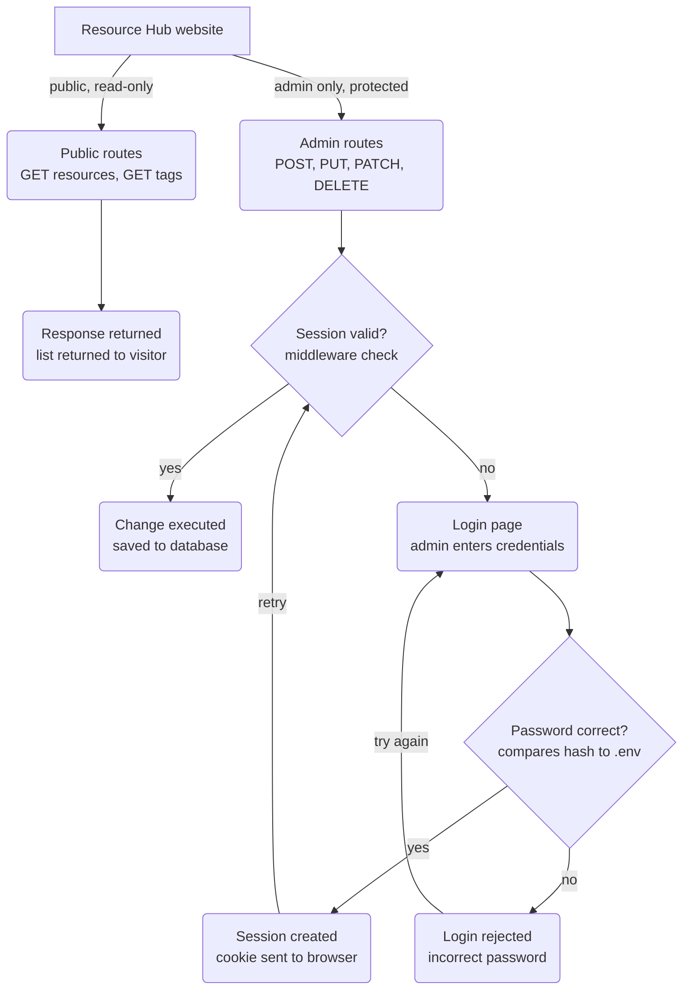

```mermaid
flowchart TD
A[Resource Hub website] -->|public, read-only| B(Public routes<br>GET resources, GET tags)
A -->|admin only, protected| C(Admin routes<br>POST, PUT, PATCH, DELETE)
B --> D(Response returned<br>list returned to visitor)
C --> E{Session valid?<br>middleware check}
E -->|yes| F(Change executed<br>saved to database)
E -->|no| G(Login page<br>admin enters credentials)
G --> H{Password correct?<br> compares hash to .env}
H -->|yes| I(Session created<br>cookie sent to browser)
I -->|retry| E
H -->|no| J(Login rejected<br>incorrect password)
J -->|try again| G
```
