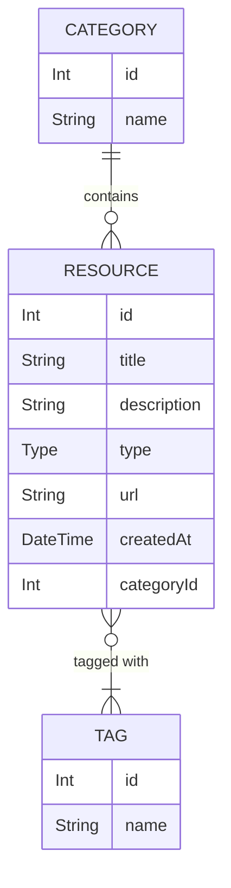

```mermaid
erDiagram
RESOURCE {
Int id
String title
String description
Type type
String url
DateTime createdAt
Int categoryId
}
CATEGORY {
Int id
String name
}
TAG {
Int id
String name
}
CATEGORY ||--o{ RESOURCE : "contains"
RESOURCE }o--|{ TAG : "tagged with"
```

type is constrained to an enum with two values: Tool and Docs
